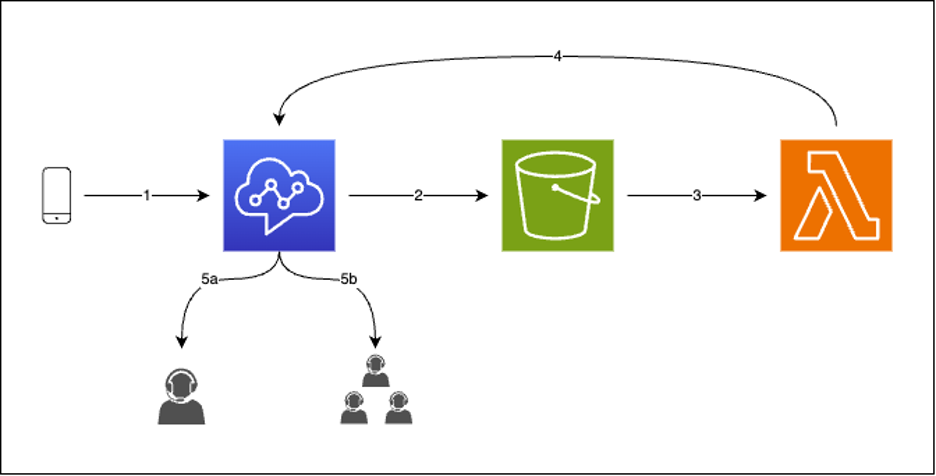
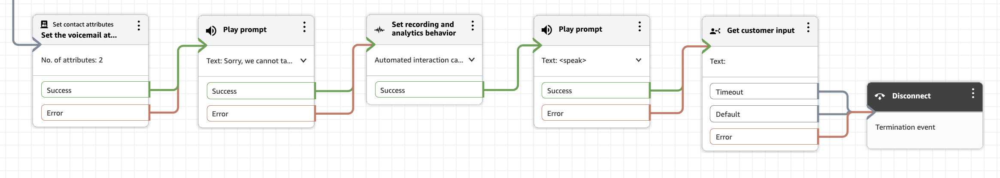
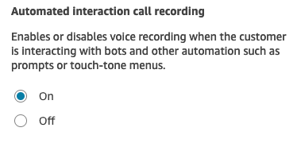
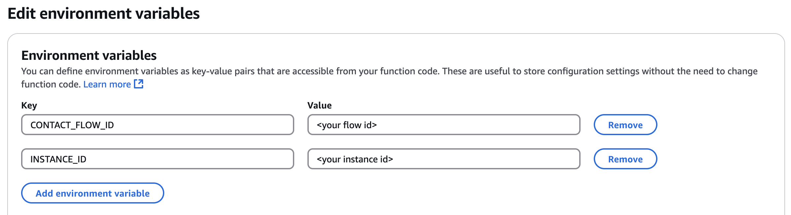
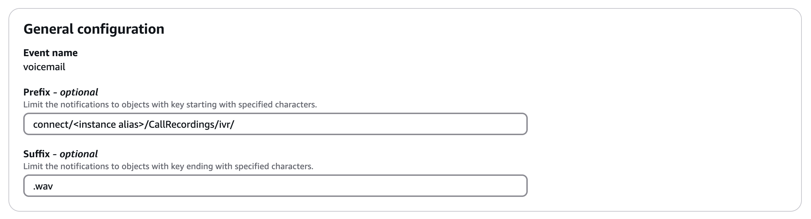
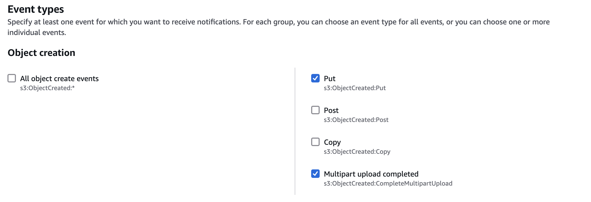
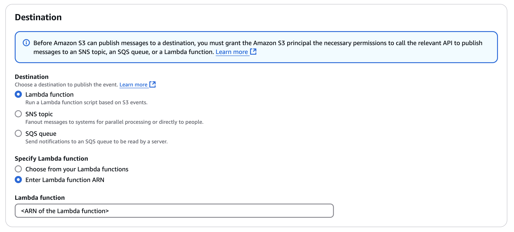

# Amazon Connect IVR recording voicemail

[Amazon Connect](https://aws.amazon.com/connect/) is an easy to use omnichannel cloud contact center that helps companies provide superior customer service at a lower cost. More than 10 years ago, Amazon’s retail business needed a contact center that would give our customers personal, dynamic, and natural experiences. We couldn’t find one that met our needs, so we built it. We’ve now made this available for all businesses, and today thousands of companies ranging from 10 to tens of thousands of agents use Amazon Connect to serve millions of customers daily.
Designed from the ground up to be omnichannel, Amazon Connect provides a seamless experience across interactions for your customers and agents. This includes one set of tools for skills-based routing, powerful real-time and historical analytics, and easy-to-use intuitive management tools – all with pay-as-you-go pricing, which means Amazon Connect simplifies contact center operations, improves agent efficiency, and lowers costs. You can set up a contact center in minutes that can scale to support millions of customers.

## Why this project?

In today's fast-paced contact center environment, businesses face the challenge of managing high call volumes while maintaining service quality. A flexible voicemail system can significantly improve both customer experience and agent efficiency. Modern contact centers require a nuanced approach that operates at multiple levels - from queue-wide implementations handling overflow during peak hours to personalized agent-level voicemail boxes ensuring messages reach their intended recipients.

This project demonstrates how to implement a simple yet effective voicemail system in your contact center using Amazon Connect's native automated interaction recording capabilities.

### Architecture

The following diagram illustrates the high-level architecture for the solution:

1. The customer places a call, and the conditions to offer voicemail are met
2. Automated interaction recording is enabled, and the required contact attributes are set
3. The caller has left a voice message and the recording is stored in the Amazon S3 bucket associated to the Amazon Connect instance
4. An event informing of the availability of the new recording in S3 is generated and an AWS Lambda function is activated
5. The function confirms the recording is a voicemail recording, obtains the metadata from the contact, generates a link to the recording audio and creates a Task in Amazon Connect
6. The task, which includes a link to the call recording of the new voicemail is sent as an Amazon Connect flow

By primarily leveraging native Amazon Connect features (automated recording, flows, and tasks), this solution maintains simplicity while requiring minimal additional AWS services (S3 Event Notification and Lambda) to deliver full voicemail functionality.

## Deployment

To deploy this solution, you will need to create:
- An AWS Lambda function (currently nodejs22.x runtime)
- An Amazon S3 event notifications
- An Amazon Connect flow to capture the customers voicemail
- An Amazon Connect flow to assign a task to a Queue

### 1. Prerequisites

Before deploying this solution you will need to capture a few details from the AWS Console:
1. [Amazon Connect instance ID](https://docs.aws.amazon.com/connect/latest/adminguide/find-instance-arn.html)
2. [Amazon Connect instance alias](https://docs.aws.amazon.com/connect/latest/adminguide/find-instance-name.html)
3. S3 Bucket associated to your Amazon Connect instance - You can find it by navigating to Amazon Connect in the AWS console, selecting your Amazon Connect instance, and choosing Data storage in the left-hand side menu. The Amazon S3 bucket associated to your instance appears under **Call recordings**, and is by default in the form of *amazon-connect-xxxxxxxxxxxx*

### 2. Amazon Connect flows

The solution is driven by Amazon Connect flows and the native capability of automated interaction recording. To offer voicemail within a given customer experience, the appropriate logic needs to be deployed. This logic is provided here in its simplest form: a [flow](./voicemail.json) that can be deployed in Amazon Connect for transferring calls requiring to be directed to voicemail. It is designed to operate on a single configuration element - the destination for the notification of a new voicemail. Ideally, you will want to have this destination be dynamic. For example, if a call was offered voicemail because no agents were available in the BasicQueue queue, you might want to consider sending the voicemail notification to that queue.
Additionally, voicemail notifications are also delivered to the intended destination as an Amazon Connect task. When generated, the notifications will be assigned to a flow for delivery, and a basic [voicemail notifications](./voicemail-notifications-routing.json) delivery flow is included in this solution.

#### 2.1 Capture the customer voicemail

1. Download the [sample flow](./voicemail.json) from this repository
2. Within the Amazon Connect console [import the flow](https://docs.aws.amazon.com/connect/latest/adminguide/contact-flow-import-export.html#how-to-import-export-contact-flows) and review its design

> [!IMPORTANT]  
> To be detected as a voicemail, a given contact *must have*:
> - A contact attribute `voicemail` with a value set to `true`
> - A contact attribute `voicemail-destination` with the value of a queue ARN. This reflects the destination the Task notification for this voicemail should be routed too (standard queue or user queue are supported)

3. Select the first block, `Set Contact Attributes`, and update the `voicemail-destination` attribute with a queue ARN where the voicemail notifications will be directed.
   - To find a queue ARN within the Amazon Connect console navigate to **Routing** on the left-side and select **Queues**. From here select a given queue and expand the 'Show additional queue information' option.
4. **Save and publish** the flow.
5. Navigate to Channels on the left side and select **Phone numbers**. Assign a phone number to the newly created flow.

This flow provides the foundational logic (displayed below) to capture voice messages within an Amazon Connect instance. This logic can be used across an instance to implement voicemail functionality wherever it may make sense for your organisation. It is recommended in future implementations to set the `voicemail-destination` dynamically.

This flow leverages the functionality of automated interaction recording within Amazon Connect to capture the customer audio. This can be seen from of the `Recording and analytics behaviour` block, which enables **Automated interaction call recording**.

This flow implements the following logic:
1. Three contact attributes are set - `voicemail = true`, `voicemail-destination = <the queue where the notification for a given voicemail will be sent>`, and `phoneNumber` which is the phone number of the customer. These attributes *are required* in order to be picked up as voicemails.
2. A prompt is played. This is the voicemail greeting. You can change it to adapt it to your needs.
3. Automated interaction recording is enabled
4. A *beep* is played to indicate the start of the recording
5. An empty **Get customer input** "holds" the interaction and allows a customer to record up to 60 seconds of audio

#### 2.2 Task routing

For agents or supervisors to receive notifications for new voicemails, this solutions utilizes [Amazon Connect Tasks](https://docs.aws.amazon.com/connect/latest/adminguide/tasks.html) to create a routable item and queue them to a chosen destination. When the Task is created, it will read the `voicemail-destination` contact attribute set in the previous flow to determine where to route the notification.

1. Download the [Voicemail Routing Flow](./voicemail-routing.json) from this repository
2. Within the Amazon Connect console [import the flow](https://docs.aws.amazon.com/connect/latest/adminguide/contact-flow-import-export.html#how-to-import-export-contact-flows) and review its design
3. **Save and publish** the flow.
4. Capture the flow ARN, found by selecting the **About this flow** option in the bottom left of the flow editor. This will be used in the next section when you create the AWS Lambda function.

### 3. Create and deploy the AWS Lambda function (nodejs22.x)

At a high-level, when a new recording is uploaded to S3, this function processes it by first extracting a Contact ID from the S3 Object Key. It then checks if the contact is marked as a voicemail by retrieving the contact attributes from Amazon Connect. If confirmed as a voicemail, it creates a pre-signed URL for the recording (valid for 48 hours) and creates a new task in Amazon Connect with the recording URL and destination information. The task is created with a reference to the original contact and includes the voicemail recording URL, making it accessible to agents through the Connect interface.

1. In the AWS console, navigate to AWS Lambda and select **Create function**
2. Input a function name (e.g. `ConnectVoicemailFunction`), ensure the runtime is set to `Node.JS 22.x` and select **Create function**

> [!NOTE] 
> As new runtimes are released, and old runtime are deprecated, the runtime to choose might differ from the one at time of writing. This solution has been written to be "forward-compatible", and is based on AWS SDK v3.

3. Once the function has been created you can use [index.mjs](./index.mjs) found in this respository to either:
   - Copy and paste the code into the *index.mjs* file of your created Lambda function (recommended)
   - Download and zip *index.mjs* from this repository and use the .zip upload functionality of the AWS Lambda console to upload the file
4. Create two [environment variables](https://docs.aws.amazon.com/lambda/latest/dg/configuration-envvars.html)
   - Key: `INSTANCE_ID` | Value: The Instance ID captured in Section 1 'Prerequesites'
   - Key: `CONTACT_FLOW_ID` | Value: The flow ID portion of the flow ARN captured in Section 2.2 'Task Routing'. It is the last part of the ARN.

5. Note the Lambda function ARN. This will be used in the next section when you create an S3 event notification.
6. Update the [Execution role](https://docs.aws.amazon.com/lambda/latest/dg/permissions-executionrole-update.html) with the following policy. Navigate to the **Configuration** tab, and select **Permissions** in the left-hand side menu. You can open the execution role by clicking on the link under **Role name**. Attach a new inline policy, and in the JSON editor, paste the policy.

> [!IMPORTANT] 
> You will need to edit the below policy to point to the correct resources. This includes:
> - Amazon Connect instance ARN
> - Amazon S3 Bucket used by the Amazon Connect instance
> - Amazon Connect Contact flow ID.
> These values were captured in Section 1 'Prerequesites' and Section 2.2 'Task routing'.

    {
        "Version": "2012-10-17",
        "Statement": [
            {
                "Sid": "ConnectPermissions",
                "Effect": "Allow",
                "Action": [
                    "connect:GetContactAttributes",
                    "connect:StartTaskContact"
                ],
                "Resource": [
                    "<your Amazon Connect instance ARN>/contact/*",
                    "<your Amazon Connect instance ARN>/task-template/*",
                    "<your Amazon Connect instance ARN>/contact-flow/<your voicemail routing flow id>",
                    "<your Amazon Connect instance ARN>/transfer-destination/*"
                ]
            },
            {
                "Sid": "S3Permissions",
                "Effect": "Allow",
                "Action": [
                    "s3:GetObject",
                    "s3:ListBucket"
                ],
                "Resource": [
                    "<your S3 bucket ARN>/*",
                    "<your S3 bucket ARN>"
                ]
            }
        ]
    }

### 4. Activate Amazon S3 event notifications

Amazon S3 Event Notifications enables this solution to detect the voice recording of the customer when its loaded into the Amazon S3 bucket associated to the Amazon Connect instance. It activates the Lambda function created in the previous step.

1. In the Amazon S3 console, navigate to your S3 Bucket and select the *Properties* tab.
2. Under the *Event notifications* section, select *Create event notification*.
3. Update the following values under *General Configuration*
   - **Event Name:** A name of your choice (e.g. `connect-voicemail-s3-event`)
   - **Prefix:** The path to the IVR recording within the bucket. In the format `connect/<instance alias>/CallRecordings/ivr/`. Do not include the name of your S3 bucket in the prefix.
   - **Suffix:** `.wav`

4. Update the **Event types** to trigger on 'Put' and 'Multipart upload completed'

5. Update the **Destination** by selecting 'Enter Lambda function ARN' and specify the ARN of the function created in Section 3.

6. Select **Save changes**

### 5. Test the implementation

With your Amazon Connect flows, Lambda function and S3 event notification in place, you can now test the implementation.

1. Dial the phone number associated to the flow in Section 2.1 'Capture the customer voicemail'. Leave a voicemail after the beep.
2. Open the Amazon Connect CCP and accept the incoming Task. Select the URL within the Task to download the voicemail recording.
   - Note: Ensure the [routing profile](https://docs.aws.amazon.com/connect/latest/adminguide/routing-profiles.html) associated to your user can accept tasks from the queue you chose as the destination for this voicemail.

## Roadmap
- Add transcription of the voicemail to the task

## Support
Opening an issue in the Github project is the only path to report issues, ask for help, or log a feature request.

## Authors and acknowledgment
This solution was authored by Aurelien Plancque, Senior Specialised Solutions Architect at Amazon Web Services. Documentation produced by Aurelien Plancque and Mark Macdonald (Specialised Technical Account Manager at Amazon Web Services).

## License
MIT-0